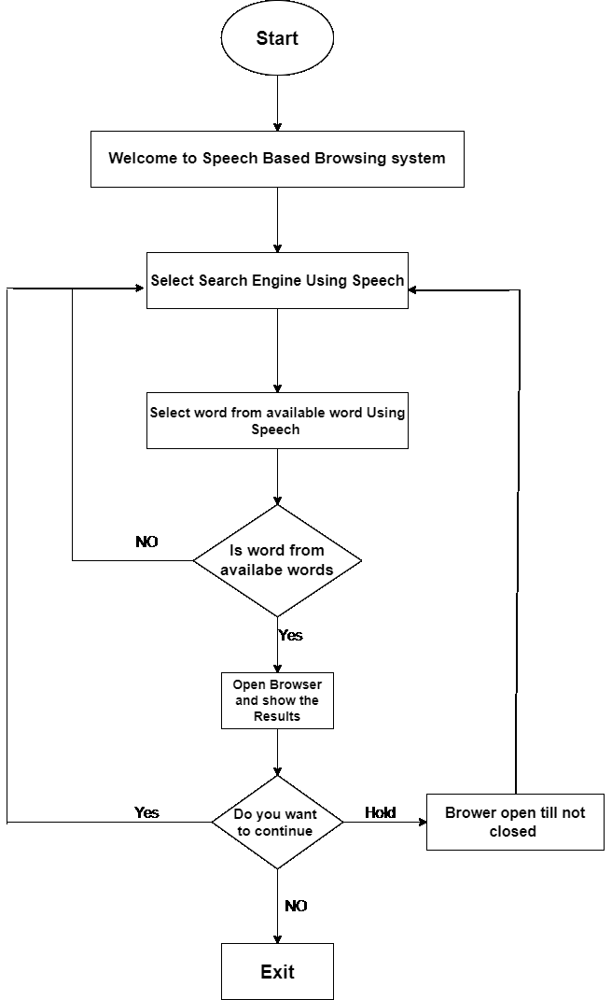
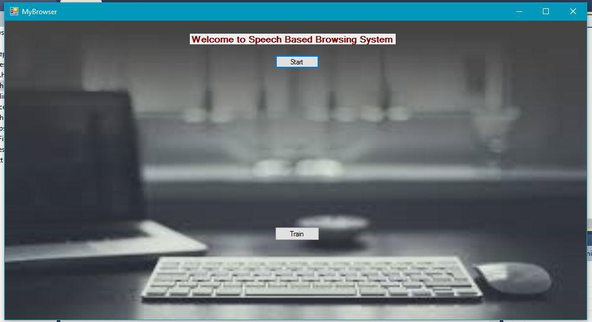
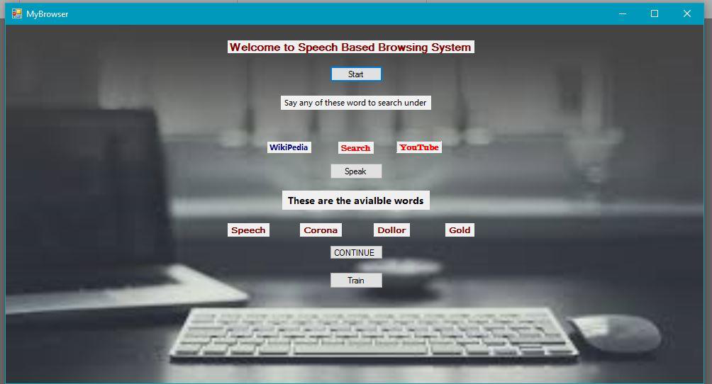
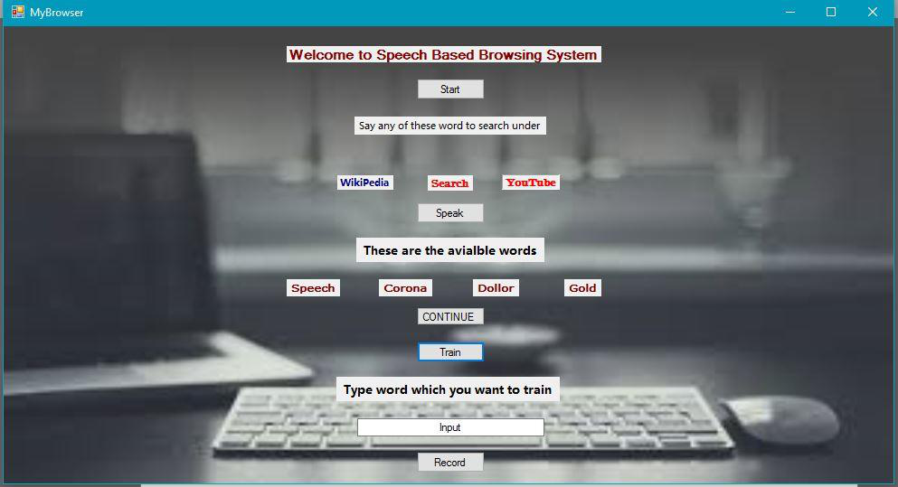

# SPEECH-BASED-BROWSER-

> **Indian Institute of Technology, Guwahati**

{width="0.925in"
height="0.9305555555555556in"}

> Department of Computer Science and Engineering

Project Report

> On\
> **"Speech Based Browser Automation"** Based on\
> Speech Recognition System

**Course: CS566 Speech Processing**

**GROUP NO 19**

> Submitted to
>
> Prof.
>
> P.K..Das

Submitted by:

Keshav Parihar (214101025)

Mohit Kumar (214101029)

**TABLE OF CONTENT**

> **1.Abstract**
>
> **2.Introduction**
>
> **3.Proposed Methodology**
>
> **4.Experimental Setup**
>
> **5.Result**
>
> **6.Source code**

**ABSTRACT**

> This document defines a set of evaluation criteria and test methods
> for speech
>
> recognition systems used in searching and retrieving contact details.
> This
>
> report is on the project which detects the contact name and show its
> details

.

**INTRODUCTION**

In this report, we concentrate on the speech recognition programs that
are human-computer

interactive. When software evaluators observe humans testing such
software programs, they

gain valuable insights into technological problems and barriers that
they may never witness

otherwise. . Testing speech recognition products for universal usability
is an important step

before considering the product to be a viable solution for its customers
later. This document

concerns Speech Recognition accuracy in contact searching and retrieving
details, which is a

critical factor in the development of hands-free human- machine
interactive devices. There

are two separate issues that we want to test: word recognition accuracy
and software

friendliness. Major factors that impede recognition accuracy in the
environment noise sources

and system noise.

**However, what is speech recognition?**

Speech recognition works like this. You speak into a microphone and the
computer transforms

the sound of your words into text to be used by your word processor or
other applications

available on your computer. The computer may repeat what you just said
or it may give you a

prompt for what you are expected to say next. This is the central
promise of interactive

speech recognition. You also had to correct any errors virtually as soon
as they happened,

which means that you had to concentrate so hard on the software that you
often forgot what

you were trying to say.

The new voice recognition systems are certainly much easier to use. You
can speak at a

normal pace without leaving distinct pauses between words. However, you
cannot really use

"*natural speech*" as claimed by the manufacturers. You must speak
clearly, as you do when

you speak to a Dictaphone or when you leave someone a telephone message.
Remember, the

computer is relying solely on your spoken words. It cannot interpret
your tone or inflection,

and it cannot interpret your gestures and facial expressions, which are
part of everyday human

communication. Some of the systems also look at whole phrases, not just
the individual words

you speak. They try to get information from the context of your speech,
to help work out the

correct interpretation.

The goal of this project is to define a set of evaluation criteria and
test methods for the

interactive voice recognition systems for searching contact and
retrieving corresponding

details for successful search.

**PROPOSED METHODOLOGY**

Basic requirements to develop this project are as follows:

Windows OS\
Microsoft Visual Studio 2010\
C++ 11 integrated with VS2010\
Recording Module

With the availability of above software, we further proceed in modelling
the logic. The prerequisites of this project are

Basic i/o operations on file\
Pre-processing of speech data\
Feature extraction\
Modelling of extracted feature\
Enhancing model

> With the availability of above tools, we further proceeded. Below is
> the flow chart for our project

{width="6.376388888888889in"
height="9.0249989063867in"}

**EXPERIMENTAL SETUP**

This project is divided into following modules: **1.Training Module**

**2.Testing Module**

**1.Training Module**

> The flow for training over data is as follows:

+-------+-------------------------------------------------------------+
| i\.   | > Record the data as 30 utterance of each word              |
+=======+=============================================================+
| ii\.  | > Extract frames for every utterance                        |
+-------+-------------------------------------------------------------+
| iii\. | Using local distance analysis (in vector quantization)      |
|       | calculate the observation                                   |
+-------+-------------------------------------------------------------+
| iv\.  | > sequence.                                                 |
+-------+-------------------------------------------------------------+
|       | > Pass this observation sequence to HMM for model           |
|       | > designing.                                                |
+-------+-------------------------------------------------------------+
| v\.   | > Now enhance the model using HMM re-estimation algorithm.  |
+-------+-------------------------------------------------------------+

> Now reference model is ready for our project. The training of data is
> not integrated with GUI application. This is different module, which
> will just evaluate reference model.

**2.Testing Module**

+--------+-----------------------------+-----------------------------+
| **3.** | > System will give          |                             |
|        | > instruction what is going |                             |
|        | > on and user is required   |                             |
|        | > to                        |                             |
+========+=============================+=============================+
|        | > follow it. The flow of    |                             |
|        | > testing is as follows:    |                             |
+--------+-----------------------------+-----------------------------+
|        | i\.                         | > Live recording of data is |
|        |                             | > done when system          |
|        |                             | > instruct.                 |
+--------+-----------------------------+-----------------------------+
|        | ii\.                        | ii\. Testing the data with  |
|        |                             | retrained models.           |
+--------+-----------------------------+-----------------------------+
|        | iii\.                       | > Detect the Search Engine  |
+--------+-----------------------------+-----------------------------+
|        | iv\.                        | iv\. Detect the word which  |
|        |                             | has to be search            |
+--------+-----------------------------+-----------------------------+
|        | v\.                         | v\. If word is correctly    |
|        |                             | spoken then it opens        |
|        |                             | browser.                    |
+--------+-----------------------------+-----------------------------+
|        | vi\.                        | vi\. If wrong word detected |
|        |                             | then ,record the input      |
|        |                             | again.                      |
+--------+-----------------------------+-----------------------------+
|        | > **WORDS USED**            |                             |
+--------+-----------------------------+-----------------------------+

**1.START**\
**2.STOP**\
**3.YES**\
**4.SEARCH**\
**5.WIKIPEDIA**\
**6.YOUTUBE**\
**7.SPEECH**\
**8.GOLD**\
**9.CORONA**\
**10.DOLLAR**

> **4.** **SCREEN SHORTS**

**INITIAL WINDOW**

{width="6.423611111111111in"
height="3.4972222222222222in"}

**WINDOW AFTER START**

{width="6.423611111111111in"
height="3.4680544619422573in"}

**CLICK TARIN BUTTON**

{width="6.423611111111111in"
height="3.486111111111111in"}

**RESULT**\
For offline testing, we took 30 recordings of each word, with
deterministic difference of maximum and second maximum P (O/lambda) we
got 85% accuracy and without considering deterministic difference we got
95% accuracy.

The Spoken word will open in browser with selected Search engine i.e.
YouTube , Google or Wikipedia , Then we search for the available words.
